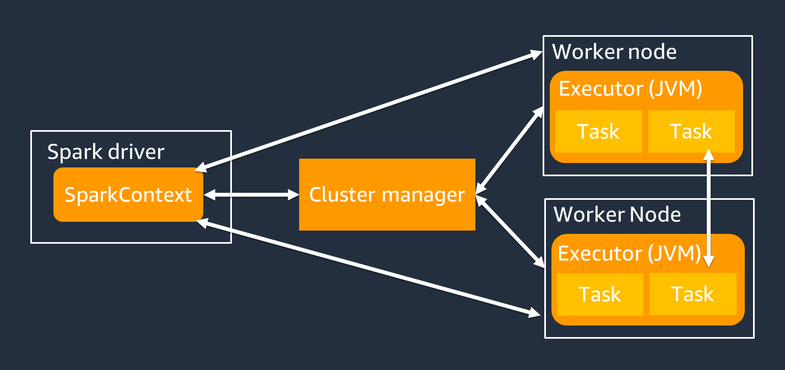
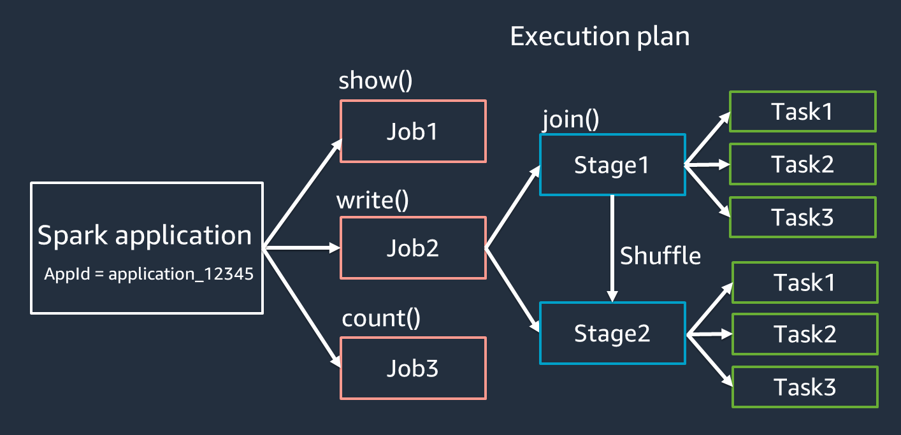
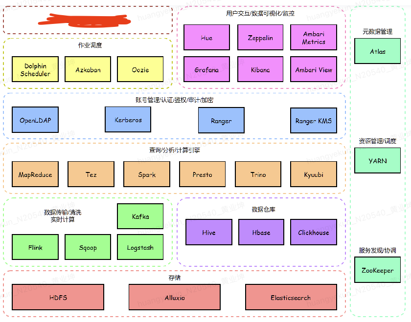

# spark-poc

## Spark基础
### RDD

RDDs（Resilient Distributed Datasets，弹性分布式数据集）是 Spark 中的逻辑数据单元。
一个 RDD 以 分区（Partition） 进行划分，并分布在集群的各个节点上：一个 RDD 可以被分割成多个逻辑分区，这些分区可以存储在集群的不同机器上，并在其上进行处理。
- 弹性：RDD 通过跟踪数据的 血统信息来恢复丢失的数据，在发生故障时能够 自动恢复。
- 分布式存储：RDD 中的数据分布在 多个节点 上，以实现并行计算。
- 延迟计算：即使 RDD 被定义，数据 不会立即加载；只有当执行 Action 操作 时，之前的 Transformation 转换 才会真正被计算。
- 不可变：RDD 中存储的数据是 只读的，一旦创建，不能被修改。
- 内存计算：RDD 将中间计算结果存储在内存中，以减少磁盘 I/O，提高计算速度。

### 架构组件

- Spark Driver：主要负责将 Spark 应用程序拆分为可以在各个 Worker 节点上执行的任务。
    - 运行代码中的 main() 方法
	- **生成执行计划**（需要特别注意在数据源元数据过多的情况下容易OOM）
	- 与集群管理器协作管理 Spark 执行器
	- 任务调度，并向 Spark 执行器请求任务
	- 管理任务进度和故障恢复
    - SparkContext 对象与 Spark Driver 进行交互，以运行作业
- Cluster Manager：分配资源，将作业拆分为多个小任务
- Spark Executor：执行集群管理器分配的任务，其生命周期与 Spark 应用程序相同

### 执行流程&术语

- 应用程序（Application）：基于 Spark 会话（SparkContext）运行的作业，具有唯一的 ID，如 <application_XXX>。
- 作业（Jobs）：基于对 RDD 触发的 Action 操作 生成，一个作业由一个或多个 阶段（Stages） 组成。
- 阶段（Stages）：基于 RDD 之间的 Shuffle 操作 生成，一个阶段包含一个或多个 任务（Tasks）。Shuffle 是 Spark 重新分配数据 的机制，使其在 RDD 分区中以不同方式分组。某些转换操作（如 join()）需要 Shuffle。有关 Shuffle 的详细优化，请参考 优化 Shuffle 调优实践。
- 任务（Tasks）：Spark 调度的最小计算单元，每个 RDD 分区都会生成一个任务。任务的数量决定了该阶段最多可以 并行执行的任务数。

### 执行模式
Spark 运行模式
- 集群模式（Cluster Mode）：最常用的模式，所有相关进程（包括 Driver）都托管在集群上。
    - 任务提交给 集群管理器 进行调度。
    - Driver 进程运行在 Worker 节点 上，而不是提交任务的机器。
	- 集群管理器负责管理应用程序相关的进程。
- 客户端模式（Client Mode）：与 集群模式 类似，但 Driver 进程运行在提交任务的客户端机器上，而不是集群中的 Worker 节点。
- 本地模式（Local Mode）：整个 Spark 应用程序在 单台机器 上运行，适用于开发、测试和小规模数据处理。

### Spark On Yarn
YARN（Yet Another Resource Negotiator）是 Hadoop 生态中的 资源管理框架，用于 管理和调度 Spark 任务的资源。在 Spark on YARN 模式下，YARN 负责 资源调度、任务分配、进程管理，并替代 Spark Standalone 模式中的 Cluster Manager。

### SparkStreaming

## Spark常见问题

### checkpoint
### SparkStreaming ETL技巧
### Kafka集成
### 文件写磁盘小文件治理
### shuffle与数据倾斜
### 参数调优
### SparkSQL vs Spark Dataframe 
### 集成AWS EKS

## HDP大数据平台架构
以下介绍以Apache Amabari为基础，整合业内主流大数据服务，构建一套完整的大数据解决方案。HDP是 Hortonworks Data Platform的简称，是Hortonworks公司推出的一套开源大数据平台，和Cloudera公司主推的另一套 CDH平台并称业内两大主流开源大数据解决方案。这两家并成一家公司，对行业行成垄断，并推出了他们的后继产品 Cloudera Data Platform(CDP)。但是 CDP产品策略公司也是大数据领域的龙头企业，目前已经合是盈利，并不开源，社区版也存在一些限制，因此大部分公司仍在使用 HDP和 CDH。
hdp

**Ambari架构**

Ambari是非常典型的server-agent架构，每个机器都部署了agent进程，向server端汇过webui实现集中化的管理，包括大数据服的部署，配置修改，监控，命令下发等。目前agent进程通过puppet统一部署和维护，server端需要人工部署和初始化。

**大数据平台**

上图为HDP平台整体架构，共涵盖30多个服务和工具，大部分通过ambari集中部署和管理，但由于ambari和hdp平台已经不再迭代更新，有部分服务是在hdp平台的基础上，通过puppet或者其他手段单独部署并集成的。其中，部分服务和工具身兼多种用途，比如spark、flink、clickhouse，这里以他们目前主要用途进行了模块划分，不代表他们只有这个功能。

**部分组件介绍**

|服务名|简介|主要用途|
|-----|---|-------|
|123|12|123|