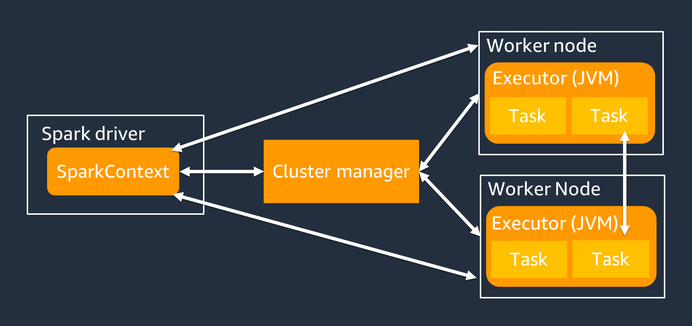
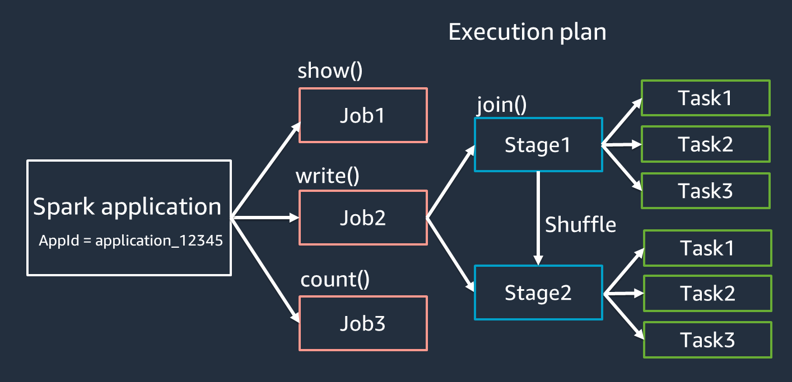
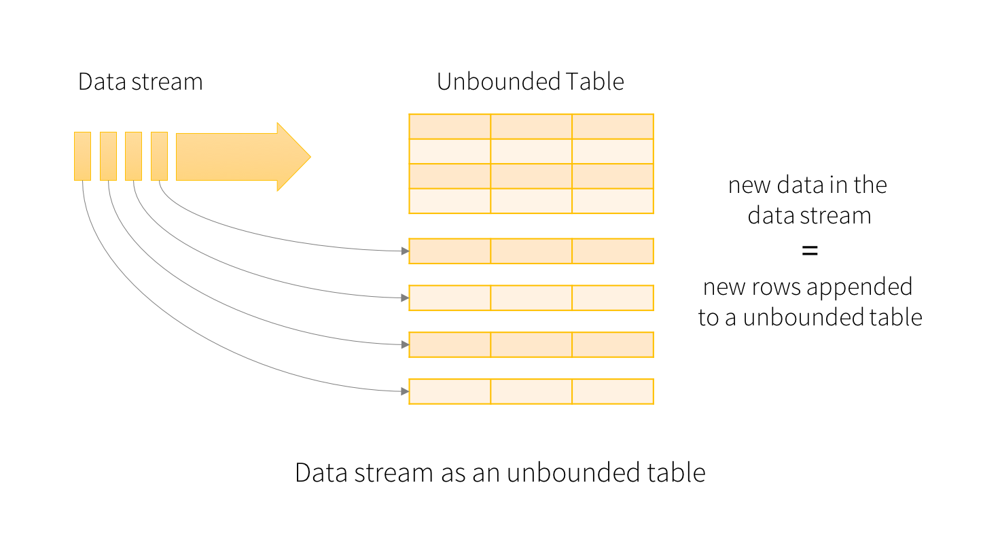
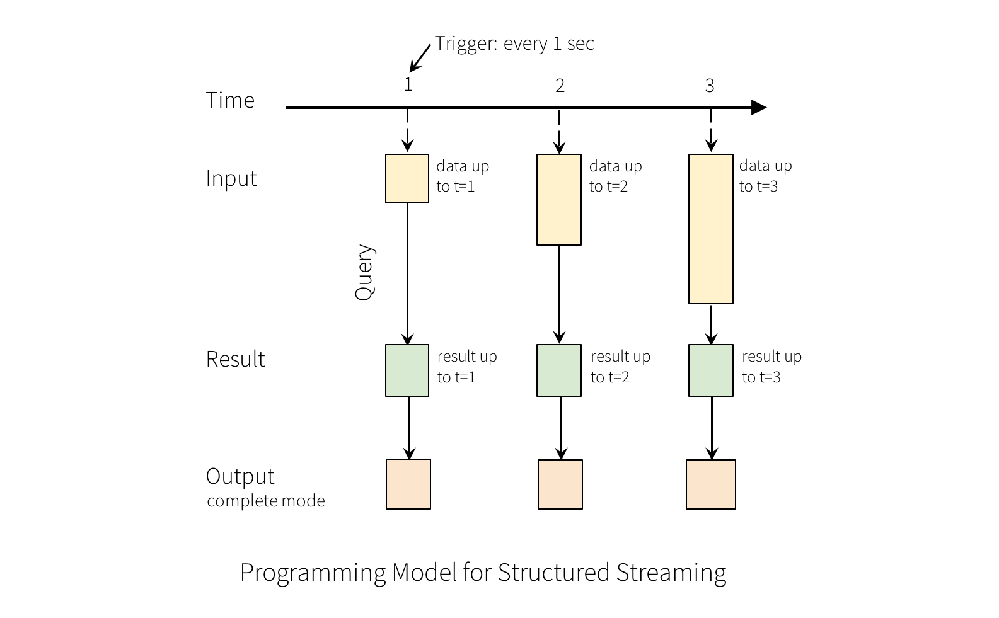

# Spark基础
## RDD
https://spark.apache.org/docs/latest/rdd-programming-guide.html


RDDs（Resilient Distributed Datasets，弹性分布式数据集）是 Spark 中的逻辑数据单元。
一个 RDD 以 分区（Partition） 进行划分，并分布在集群的各个节点上：一个 RDD 可以被分割成多个逻辑分区，这些分区可以存储在集群的不同机器上，并在其上进行处理。
- 弹性：RDD 通过跟踪数据的 血统信息来恢复丢失的数据，在发生故障时能够 自动恢复。
- 分布式存储：RDD 中的数据分布在 多个节点 上，以实现并行计算。
- 延迟计算：即使 RDD 被定义，数据 不会立即加载；只有当执行 Action 操作 时，之前的 Transformation 转换 才会真正被计算。
- 不可变：RDD 中存储的数据是 只读的，一旦创建，不能被修改。
- 内存计算：RDD 将中间计算结果存储在内存中，以减少磁盘 I/O，提高计算速度。
- 宽依赖vs窄依赖：https://blog.csdn.net/Colton_Null/article/details/112299969

## 架构组件
https://spark.apache.org/docs/latest/cluster-overview.html

- Spark Driver：主要负责将 Spark 应用程序拆分为可以在各个 Worker 节点上执行的任务。
    - 运行代码中的 main() 方法
	- **生成执行计划**（需要特别注意在数据源元数据过多的情况下容易OOM）
	- 与集群管理器协作管理 Spark 执行器
	- 任务调度，并向 Spark 执行器请求任务
	- 管理任务进度和故障恢复
    - SparkContext 对象与 Spark Driver 进行交互，以运行作业
- Cluster Manager：分配资源，将作业拆分为多个小任务
- Spark Executor：执行集群管理器分配的任务，其生命周期与 Spark 应用程序相同

执行模式
- 集群模式（Cluster Mode）：最常用的模式，所有相关进程（包括 Driver）都托管在集群上。
    - 任务提交给 集群管理器 进行调度。
    - Driver 进程运行在 Worker 节点 上，而不是提交任务的机器。
	- 集群管理器负责管理应用程序相关的进程。
- 客户端模式（Client Mode）：与 集群模式 类似，但 Driver 进程运行在提交任务的客户端机器上，而不是集群中的 Worker 节点。
- 本地模式（Local Mode）：整个 Spark 应用程序在 单台机器 上运行，适用于开发、测试和小规模数据处理。

## 执行流程&术语

- 应用程序（Application）：基于 Spark 会话（SparkContext）运行的作业，具有唯一的 ID，如 <application_XXX>。
- 作业（Jobs）：基于对 RDD 触发的 Action 操作 生成，一个作业由一个或多个 阶段（Stages） 组成。
- 阶段（Stages）：基于 RDD 之间的 Shuffle 操作 生成，一个阶段包含一个或多个 任务（Tasks）。Shuffle 是 Spark 重新分配数据 的机制，使其在 RDD 分区中以不同方式分组。某些转换操作（如 join()）需要 Shuffle。有关 Shuffle 的详细优化，请参考 优化 Shuffle 调优实践。
- 任务（Tasks）：Spark 调度的最小计算单元，每个 RDD 分区都会生成一个任务。任务的数量决定了该阶段最多可以 并行执行的任务数。


## Spark On Yarn
YARN（Yet Another Resource Negotiator）是 Hadoop 生态中的 资源管理框架，用于 管理和调度 Spark 任务的资源。在 Spark on YARN 模式下，YARN 负责 资源调度、任务分配、进程管理，并替代 Spark Standalone 模式中的 Cluster Manager。


Spark on YARN 的资源分配流程

- Spark Driver 向 YARN 资源管理器（Resource Manager）请求资源分配。
- YARN 资源管理器（Resource Manager）响应请求并分配资源。
- YARN 的节点管理器（Node Manager）在分配的容器（Container）中启动 Spark Executor，并执行计算任务。


## StructureStreaming
Spark2.0引入的新型流式计算模型，主要是实现了continuous application，并提供了强一致性，支持 Exactly-Once 语义等特性。其编程模型的核心概念主要是将流式操作抽象化成持续增长的数据表。

https://spark.apache.org/docs/latest/structured-streaming-programming-guide.html

https://www.databricks.com/spark/getting-started-with-apache-spark/streaming

https://zhuanlan.zhihu.com/p/51883927




# Spark常见问题
## 并发控制
一般Spark/Spark Streaming 的并发度（Concurrency）主要由 数据源、分区数、计算资源、任务调度 等多个因素决定。下面详细介绍如何控制并发度。

1. 其最核心的因素是RDD 分区数（Partitions），Spark 任务的并发度 = RDD 分区数，因为 Spark 每个分区（Partition）对应一个 Task，可以并行执行。分区越多，并发度越高，但过多的分区会增加调度开销。读文件系统显式制定分区数：
    ```
    rdd = ssc.textFileStream("hdfs://path/to/file").repartition(10)
    ```
    读取 Kafka 时，可以 设置 numPartitions(Kafka 分区数决定最大并发数，因为 每个分区只能被一个 Task 消费。)：
    ```
    kafkaParams = {"metadata.broker.list": "kafka-broker:9092"}
    stream = KafkaUtils.createDirectStream(ssc, ["topic"], kafkaParams, numPartitions=10)
    ```

2. 计算资源的影响
Spark Streaming 任务的 并行度受限于 Executor 线程数。任务并行数 = Executor 总核数 / 每个 Task 所占用的核数。
    ```
    # 总并行 Task 数 = executor-cores × num-executors。
    # 增加 Executor 核心数可以提高并发度，但超过某个阈值后，任务调度会变慢。
    spark-submit --master yarn \
    --deploy-mode cluster \
    --executor-cores 4 \   # 每个 Executor 使用 4 核
    --num-executors 5 \    # 启动 5 个 Executor
    my_spark_streaming_job.py
    ```

3.  Batch Interval（批次间隔）Spark Streaming 采用 微批（Micro-Batch）模式，Batch Interval 决定了 数据处理的时间窗口。
	- 批次间隔太短：Spark 需要更快完成任务，否则 任务积压，导致延迟增加。
	- 批次间隔太长：可能导致数据处理延迟增加，并且并发度下降。
    ```
    # 如果批次处理时间 > Batch Interval，任务会积压。
    # 通常 Batch Interval 设为 1~10 秒，保证任务能在间隔时间内完成。
    
    ssc = StreamingContext(sparkContext, 5)  # 每 5 秒一个批次
    ```

4. 小文件的影响

    https://medium.com/globant/how-to-solve-a-large-number-of-small-files-problem-in-spark-21f819eb36d3

    - 为什么小文件会影响并发度：
      
      Spark 默认每个文件生成一个任务（Task），如果 HDFS/S3 存在 大量小文件，Spark 需要为每个小文件创建一个独立的任务。如果小文件过多：
      - 任务调度开销过大：过多的 Task 增加了 Driver 的调度压力，使 Spark 需要更多时间分配任务，而不是执行计算； 
      - IO 负载增加：每个小文件都需要 单独打开、读取、解析，大量 open() 操作会占用 HDFS NameNode 或 S3 API 资源，降低吞吐量。
      - Executor 资源利用率低：如果一个任务仅处理一个小文件，而文件内容很少，Executor 计算任务很快结束，但 Spark 仍然需要调度这些任务，导致 CPU 资源浪费。

      但如果小文件太少：并发度受限：
        - 如果一个批次内文件数量 少于可用的 Executor 核心数，Spark 并发度会被文件数量限制，导致计算资源未被充分利用，任务处理速度变慢
    
    - pyarrow如何改善小文件的影响
        - 应对小文件较多的场景，使用 PyArrow 预处理小文件，将多个 JSON/CSV 文件合并成单个大 Parquet 文件，从而减少 Spark Streaming 读取文件的数量。
        - 如果需要处理单个大 Parquet 文件，可以让 Spark通过pyarrow只读取需要的列，而不是整个文件，从而减少不必要的数据加载。例如，可以使用PyArrow在Python端先行处理大 Parquet 文件，按行或列切分后，再转换为 Spark DataFrame，避免Spark在单个Executor上处理超大数据量。

## HA高可用
https://learn.microsoft.com/zh-cn/azure/hdinsight/spark/apache-spark-streaming-high-availability

https://blog.csdn.net/weixin_42526352/article/details/105623515

常见的流式作业保证HA的手段无非以下几种

1.  采用 Checkpoint（Checkpoint 存储 RDD 依赖关系 & Streaming 元数据，在任务重启后恢复状态。）

2. 启用 WAL（日志预写）防止数据丢失（默认情况下，数据只保留在 内存（RDD） 中，Executor 失败会导致 数据丢失。Write Ahead Log（WAL，预写日志） 让数据先写入 HDFS / S3 / Kafka，确保数据可恢复。）

3. 使用 Kafka + Direct API （Kafka Direct API 允许 Spark Streaming 手动管理偏移量，比传统 Receiver 方式更安全）

4. 开启 Driver 高可用（HA）。Driver 是 Spark Streaming 任务的核心，负责调度任务、管理批次、维护状态。如果 Driver 崩溃，整个作业会失败。一般通过基于Yarn的集群模式自动实现。

5. Executor 高可用（Task 重试 & 资源动态分配）
    - 启用任务重试： ```spark-submit --conf spark.task.maxFailures=4 ...```
    - 启用动态资源分配：```spark-submit --conf spark.dynamicAllocation.enabled=true ...```

6. Structured Streaming。与Spark Streaming主要的区别是支持 支持 Exactly-Once 语义，自动恢复，避免数据丢失。

    https://spark.apache.org/docs/latest/structured-streaming-programming-guide.html


## 背压
Spark Streaming 默认 尽可能快地消费数据，如果数据流量突然增加，可能导致 数据积压。	Backpressure 允许 Spark 动态调整并发度，防止数据处理崩溃。
```
spark.streaming.backpressure.enabled=true
```
## 动态资源伸缩
https://medium.com/@pmatpadi/spark-streaming-dynamic-scaling-and-backpressure-in-action-6ebdbc782a69
## 小文件问题
https://blog.csdn.net/hellojoy/article/details/113665874

https://my.oschina.net/dreamness/blog/3082906

https://www.modb.pro/db/423478

在 Spark 任务执行过程中，特别是在 从 HDFS 读取数据 或 Spark Streaming 落盘 时，可能会产生 大量小文件，导致 性能下降 和 任务执行效率降低。
-  HDFS 适合存储大文件，如果有太多 小文件（小于 HDFS Block Size，一般是 128MB 或 256MB），会 消耗大量 NameNode 资源，影响集群性能。
-  在 Spark Streaming 任务中，实时数据写入 HDFS 时，由于数据量小、批次间隔短，会不断创建小文件，造成 NameNode 过载 和 后续任务 IO 瓶颈。

在 Spark Streaming 任务 中，每个批次（Batch）生成的数据 默认会写入 HDFS，但由于 数据量较小、写入频繁，会产生 大量小文件：
- 短时间间隔的微批（Micro-batch）：例如 批次间隔（batch interval）= 1 秒，意味着 每秒都会写入一个文件，长期运行后，HDFS 上会产生 大量 1 秒间隔的小文件。
- 并行度导致多个小文件：如果 Spark Streaming 并行任务多（RDD 分区数多），每个任务可能写入一个文件，最终导致 多个 executor 并行生成多个小文件。
- 使用 saveAsTextFile() 或 saveAsParquet()：这些 API 会为每个 RDD 分区生成一个单独的文件，当分区过多时，会在 HDFS 生成 过多小文件。

代码层面的解决方式：

1. 通过 coalesce() 或 repartition() 合并 RDD。在写入 HDFS 之前，使用 coalesce() 或 repartition() 减少小文件数量：
```
# 读取数据
rdd = sparkContext.textFile("hdfs://namenode:8020/input/small_files")

# 合并分区，减少写入的小文件数量
merged_rdd = rdd.coalesce(10)  # 10 个分区，减少小文件
merged_rdd.saveAsTextFile("hdfs://namenode:8020/output/")
```

2.  使用 foreachRDD + 合并写入.在 Spark Streaming 中，避免直接使用 saveAsTextFile()，改用 foreachRDD 批量合并数据后再写入：
```
def saveToHDFS(time, rdd):
    if not rdd.isEmpty():
        # 合并 RDD，减少小文件
        rdd = rdd.coalesce(1)
        path = f"hdfs://namenode:8020/output/{time}"
        rdd.saveAsTextFile(path)

stream.foreachRDD(saveToHDFS)
```

3. 调整 Spark Streaming 批次间隔
```
stream = ssc.socketTextStream("localhost", 9999)
stream.window(10, 10)  # 每 10 秒处理一次
```

4. 使用 Hadoop FileOutputCommitter 优化写入
```
spark.conf.set("mapreduce.fileoutputcommitter.algorithm.version", "2")
```

5. 使用 Parquet 或 ORC 而不是 TextFile。但要注意在高
```
df.write.mode("append").parquet("hdfs://namenode:8020/output/")
```
## shuffle与数据倾斜
https://blog.csdn.net/qq_42825815/article/details/83867747

Shuffle 是 Spark 重新分配数据 的机制，用于 在 RDD 分区之间重新分组数据，确保分布式计算能够正确执行

Shuffle 触发的原因
1.	某些分组或聚合操作会触发 Shuffle：
    - join()
	- groupByKey()
	- reduceByKey()
2.	数据分区（Partitioning）和重新分区（Repartition）：
	- Spark 需要在 不同节点之间重新划分数据，以便执行计算

 Shuffle 的成本
- 磁盘 I/O：Shuffle 过程中会在磁盘上生成大量 中间文件，增加存储开销。
- 网络 I/O：数据需要在 Executor 之间传输，造成网络负担。
- CPU 和内存开销：
- 数据排序（Sorting）：Shuffle 过程中需要对数据进行排序。
- 数据合并（Merging）：多个分区的数据需要合并，增加计算负担。

优化 Join 操作
1. 在 Join 之前进行数据过滤（Pushdown）
    - 减少 Shuffle 传输的数据量，降低网络 IO 负担。
    - 减少 Spark Executor 的计算负担，优化 CPU 和内存利用率。
    - 减少数据扫描（Data Scan），提高查询速度。

2. 使用 Broadcast Hash Join
    - Broadcast Hash Join 不需要 Shuffle，适用于 小表 Join 大表 的场景。
    - 工作机制：
	    - 将小表广播（Broadcast）到每个 Worker 节点，并 在 Map 端与大表的每个分区进行本地 Join，避免跨节点 Shuffle。
	    - 小表需能装入内存，通常放在 Join 语句右侧。

3. 开启 AQE（Adaptive Query Execution，自适应查询优化）
    - 自动将普通 Join 转换为 Broadcast Hash Join，当运行时统计发现 一侧表大小小于 AQE 阈值 时，会自动进行优化。

4.  使用 Bucketing（分桶）
    - 预先对 Join Key 进行 Shuffle 和排序，并将数据写入 中间分桶表，减少 Join 时的 Shuffle 开销。
    ```
    df.write.bucketBy(50, "account_id").sortBy("age").saveAsTable("bucketed_table")
    ```

5. 在 Join 之前手动对 DataFrame 进行 Repartition
    ```
    在 Join 之前手动对 DataFrame 进行 Repartition
    ```

6. 选择高基数（High Cardinality）的 Join Key
    - 尽量选择值范围广的 Join Key，避免低基数（Low Cardinality）的 Key 导致数据倾斜。
	- 避免所有数据都落在少量分区上，导致某些 Executor 过载，而其他 Executor 空闲。

shuffle的类型（hash shuffle，sort shuffle）：
https://cloud.tencent.com/developer/article/1337388
## 其他参数调优
https://spark.apache.org/docs/latest/configuration.html#spark-streaming

## SparkSQL vs Spark Dataframe 
## 集成AWS EKS

