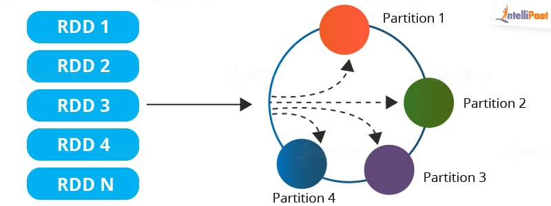

# HDP大数据平台架构
以下介绍以Apache Amabari为基础，整合业内主流大数据服务，构建一套完整的大数据解决方案。HDP是 Hortonworks Data Platform的简称，是Hortonworks公司推出的一套开源大数据平台，和Cloudera公司主推的另一套 CDH平台并称业内两大主流开源大数据解决方案。这两家并成一家公司，对行业行成垄断，并推出了他们的后继产品 Cloudera Data Platform(CDP)。但是 CDP产品策略公司也是大数据领域的龙头企业，目前已经合是盈利，并不开源，社区版也存在一些限制，因此大部分公司仍在使用 HDP和 CDH。
hdp

**Ambari架构**


Ambari是非常典型的server-agent架构，每个机器都部署了agent进程，向server端汇过webui实现集中化的管理，包括大数据服的部署，配置修改，监控，命令下发等。目前agent进程通过puppet统一部署和维护，server端需要人工部署和初始化。

**大数据平台**


上图为HDP平台整体架构，共涵盖30多个服务和工具，大部分通过ambari集中部署和管理，但由于ambari和hdp平台已经不再迭代更新，有部分服务是在hdp平台的基础上，通过puppet或者其他手段单独部署并集成的。其中，部分服务和工具身兼多种用途，比如spark、flink、clickhouse，这里以他们目前主要用途进行了模块划分，不代表他们只有这个功能。

**部分组件介绍**

|服务名|简介|主要用途|
|-----|---|-------|
|123|12|123|

# Spark基础
## RDD
https://spark.apache.org/docs/latest/rdd-programming-guide.html


RDDs（Resilient Distributed Datasets，弹性分布式数据集）是 Spark 中的逻辑数据单元。
一个 RDD 以 分区（Partition） 进行划分，并分布在集群的各个节点上：一个 RDD 可以被分割成多个逻辑分区，这些分区可以存储在集群的不同机器上，并在其上进行处理。
- 弹性：RDD 通过跟踪数据的 血统信息来恢复丢失的数据，在发生故障时能够 自动恢复。
- 分布式存储：RDD 中的数据分布在 多个节点 上，以实现并行计算。
- 延迟计算：即使 RDD 被定义，数据 不会立即加载；只有当执行 Action 操作 时，之前的 Transformation 转换 才会真正被计算。
- 不可变：RDD 中存储的数据是 只读的，一旦创建，不能被修改。
- 内存计算：RDD 将中间计算结果存储在内存中，以减少磁盘 I/O，提高计算速度。

## 架构组件
https://spark.apache.org/docs/latest/cluster-overview.html

- Spark Driver：主要负责将 Spark 应用程序拆分为可以在各个 Worker 节点上执行的任务。
    - 运行代码中的 main() 方法
	- **生成执行计划**（需要特别注意在数据源元数据过多的情况下容易OOM）
	- 与集群管理器协作管理 Spark 执行器
	- 任务调度，并向 Spark 执行器请求任务
	- 管理任务进度和故障恢复
    - SparkContext 对象与 Spark Driver 进行交互，以运行作业
- Cluster Manager：分配资源，将作业拆分为多个小任务
- Spark Executor：执行集群管理器分配的任务，其生命周期与 Spark 应用程序相同

执行模式
- 集群模式（Cluster Mode）：最常用的模式，所有相关进程（包括 Driver）都托管在集群上。
    - 任务提交给 集群管理器 进行调度。
    - Driver 进程运行在 Worker 节点 上，而不是提交任务的机器。
	- 集群管理器负责管理应用程序相关的进程。
- 客户端模式（Client Mode）：与 集群模式 类似，但 Driver 进程运行在提交任务的客户端机器上，而不是集群中的 Worker 节点。
- 本地模式（Local Mode）：整个 Spark 应用程序在 单台机器 上运行，适用于开发、测试和小规模数据处理。

## 执行流程&术语

- 应用程序（Application）：基于 Spark 会话（SparkContext）运行的作业，具有唯一的 ID，如 <application_XXX>。
- 作业（Jobs）：基于对 RDD 触发的 Action 操作 生成，一个作业由一个或多个 阶段（Stages） 组成。
- 阶段（Stages）：基于 RDD 之间的 Shuffle 操作 生成，一个阶段包含一个或多个 任务（Tasks）。Shuffle 是 Spark 重新分配数据 的机制，使其在 RDD 分区中以不同方式分组。某些转换操作（如 join()）需要 Shuffle。有关 Shuffle 的详细优化，请参考 优化 Shuffle 调优实践。
- 任务（Tasks）：Spark 调度的最小计算单元，每个 RDD 分区都会生成一个任务。任务的数量决定了该阶段最多可以 并行执行的任务数。


## Spark On Yarn
YARN（Yet Another Resource Negotiator）是 Hadoop 生态中的 资源管理框架，用于 管理和调度 Spark 任务的资源。在 Spark on YARN 模式下，YARN 负责 资源调度、任务分配、进程管理，并替代 Spark Standalone 模式中的 Cluster Manager。


Spark on YARN 的资源分配流程

- Spark Driver 向 YARN 资源管理器（Resource Manager）请求资源分配。
- YARN 资源管理器（Resource Manager）响应请求并分配资源。
- YARN 的节点管理器（Node Manager）在分配的容器（Container）中启动 Spark Executor，并执行计算任务。


## SparkStreaming

# Spark常见问题
## 并发控制
## HA高可用
https://learn.microsoft.com/zh-cn/azure/hdinsight/spark/apache-spark-streaming-high-availability

https://blog.csdn.net/weixin_42526352/article/details/105623515

常见的流式作业保证HA的手段无非以下几种

1.  采用 Checkpoint（Checkpoint 存储 RDD 依赖关系 & Streaming 元数据，在任务重启后恢复状态。）

2. 启用 WAL（日志预写）防止数据丢失（默认情况下，数据只保留在 内存（RDD） 中，Executor 失败会导致 数据丢失。Write Ahead Log（WAL，预写日志） 让数据先写入 HDFS / S3 / Kafka，确保数据可恢复。）

3. 使用 Kafka + Direct API （Kafka Direct API 允许 Spark Streaming 手动管理偏移量，比传统 Receiver 方式更安全）

4. 开启 Driver 高可用（HA）。Driver 是 Spark Streaming 任务的核心，负责调度任务、管理批次、维护状态。如果 Driver 崩溃，整个作业会失败。一般通过基于Yarn的集群模式自动实现。

5. Executor 高可用（Task 重试 & 资源动态分配）
    - 启用任务重试： ```spark-submit --conf spark.task.maxFailures=4 ...```
    - 启用动态资源分配：```spark-submit --conf spark.dynamicAllocation.enabled=true ...```

6. Structured Streaming。与Spark Streaming主要的区别是支持 支持 Exactly-Once 语义，自动恢复，避免数据丢失。

    https://spark.apache.org/docs/latest/structured-streaming-programming-guide.html

## 背压问题
## 动态资源伸缩
https://medium.com/@pmatpadi/spark-streaming-dynamic-scaling-and-backpressure-in-action-6ebdbc782a69
## Kafka集成
## 小文件问题
https://blog.csdn.net/hellojoy/article/details/113665874

https://my.oschina.net/dreamness/blog/3082906

https://www.modb.pro/db/423478

在 Spark 任务执行过程中，特别是在 从 HDFS 读取数据 或 Spark Streaming 落盘 时，可能会产生 大量小文件，导致 性能下降 和 任务执行效率降低。
-  HDFS 适合存储大文件，如果有太多 小文件（小于 HDFS Block Size，一般是 128MB 或 256MB），会 消耗大量 NameNode 资源，影响集群性能。
-  在 Spark Streaming 任务中，实时数据写入 HDFS 时，由于数据量小、批次间隔短，会不断创建小文件，造成 NameNode 过载 和 后续任务 IO 瓶颈。

在 Spark Streaming 任务 中，每个批次（Batch）生成的数据 默认会写入 HDFS，但由于 数据量较小、写入频繁，会产生 大量小文件：
- 短时间间隔的微批（Micro-batch）：例如 批次间隔（batch interval）= 1 秒，意味着 每秒都会写入一个文件，长期运行后，HDFS 上会产生 大量 1 秒间隔的小文件。
- 并行度导致多个小文件：如果 Spark Streaming 并行任务多（RDD 分区数多），每个任务可能写入一个文件，最终导致 多个 executor 并行生成多个小文件。
- 使用 saveAsTextFile() 或 saveAsParquet()：这些 API 会为每个 RDD 分区生成一个单独的文件，当分区过多时，会在 HDFS 生成 过多小文件。

代码层面的解决方式：

1. 通过 coalesce() 或 repartition() 合并 RDD。在写入 HDFS 之前，使用 coalesce() 或 repartition() 减少小文件数量：
```
# 读取数据
rdd = sparkContext.textFile("hdfs://namenode:8020/input/small_files")

# 合并分区，减少写入的小文件数量
merged_rdd = rdd.coalesce(10)  # 10 个分区，减少小文件
merged_rdd.saveAsTextFile("hdfs://namenode:8020/output/")
```

2.  使用 foreachRDD + 合并写入.在 Spark Streaming 中，避免直接使用 saveAsTextFile()，改用 foreachRDD 批量合并数据后再写入：
```
def saveToHDFS(time, rdd):
    if not rdd.isEmpty():
        # 合并 RDD，减少小文件
        rdd = rdd.coalesce(1)
        path = f"hdfs://namenode:8020/output/{time}"
        rdd.saveAsTextFile(path)

stream.foreachRDD(saveToHDFS)
```

3. 调整 Spark Streaming 批次间隔
```
stream = ssc.socketTextStream("localhost", 9999)
stream.window(10, 10)  # 每 10 秒处理一次
```

4. 使用 Hadoop FileOutputCommitter 优化写入
```
spark.conf.set("mapreduce.fileoutputcommitter.algorithm.version", "2")
```

5. 使用 Parquet 或 ORC 而不是 TextFile。但要注意在高
```
df.write.mode("append").parquet("hdfs://namenode:8020/output/")
```
## shuffle与数据倾斜
## 参数调优
## SparkSQL vs Spark Dataframe 
## 集成AWS EKS

